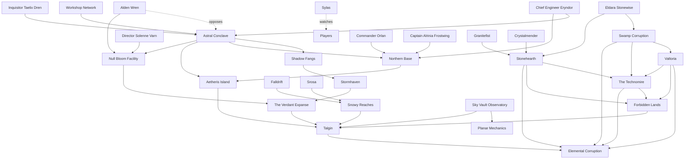

# Relationship Graph

```mermaid
graph TD
    AC[Astral Conclave] --> NBF[Null Bloom Facility]
    AC --> AI[Aetheris Island]
    AC --> NB[Northern Base]
    AC --> SF[Shadow Fangs]
    SF --> ST[Stormhaven]
    DSV[Director Solenne Varn] --> NBF
    ITD[Inquisitor Taelix Dren] --> AC
    AW[Alden Wren] --> NBF
    AW -. opposes .-> AC
    S[Sylas] -. watches .-> P[Players]
    WN[Workshop Network] --> AC
    SC[Swamp Corruption] --> EC[Elemental Corruption]
    T[Talgin] --> EC
    AI --> T
    FL[Forbidden Lands] --> T
    VE[The Verdant Expanse] --> T
    SRG[Snowy Reaches] --> T
    F[Falldrift] --> SRG
    SR[Srosa] --> SRG
    SVO[Sky Vault Observatory] --> T
    NB --> AI
    CO[Commander Orlan] --> NB
    CAF[Captain Alrinia Frostwing] --> NB
    CEE[Chief Engineer Eryndor] --> NB
    CEE --> AC
    SH[Stonehearth] --> EC
    SH --> FL
    ES[Eldara Stonewise] --> SH
    G[Granitefist] --> SH
    C[Crystalmender] --> SH
    ES --> SC
    TM[The Technomire] --> EC
    TM --> FL
    SC --> TM
    SH --> TM
    V[Valtoria] --> TM
    V --> FL
    V --> EC
    SC --> V
    ST[Stormhaven] --> VE
    NBF[Null Bloom Facility] --> VE
    SVO --> PM[Planar Mechanics]
```
